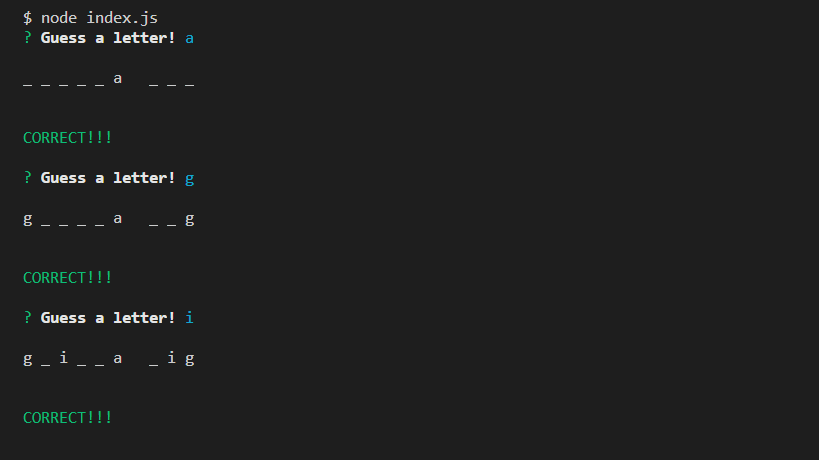
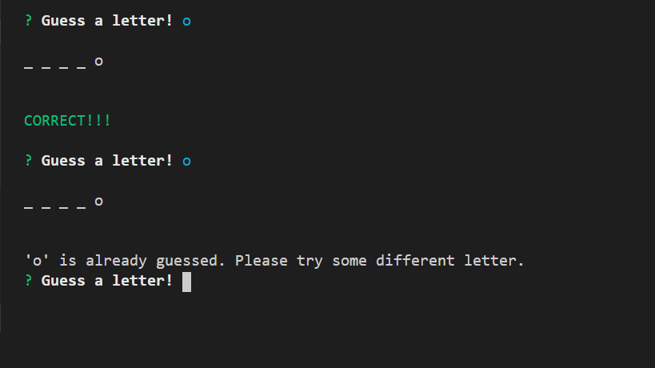
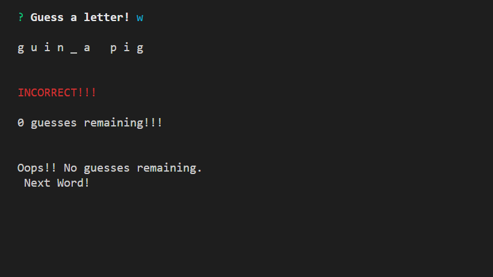
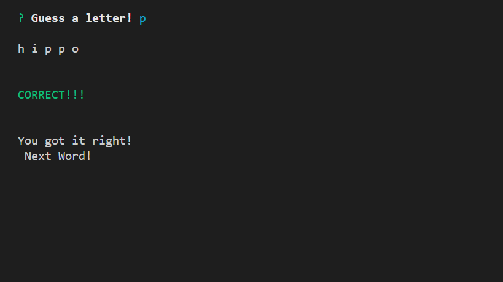
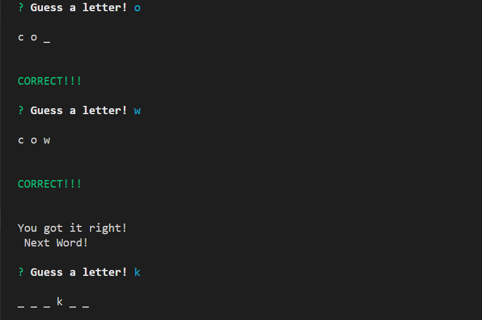
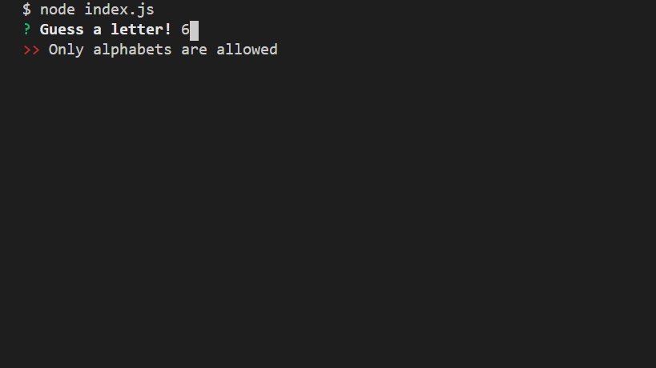

# Constructor-Word-Guess

### File

* [`constructor-word-guess`](Constructor-Word-Guess/blob/master/index.js)

### Technologies
Node, Javascript

### Description
A Word Guess command-line game using constructor functions.

1. Link: 
    * Repo Link: https://github.com/shruti-gaonkar/Constructor-Word-Guess

    * Gif Link: https://media.giphy.com/media/MXXPYGxP5rS5ObniH8/giphy.gif

2. In this game the player has to guess the names of animals.

3. The terminal prompts the player to guess the letter in the selected word.

4. If the player enters a letter eg. 'i'

   * The game shows: `_ i _ `.

   * As the user guesses the correct letters, they show up like this: `p i _`.

   * The repeated letters are shown as many times they appear in the word.

   * Word with spaces are also used in the game.

5. If player guesses same letter again, a message is displayed to enter some other letter.

6. The game shows number of guesses remaining for the player.

7. After the user wins/loses

    * Messages are displayed accordingly

    

    

    * The game automatically chooses another word and makes the user play it.

    

8. The game also validates the user input to allow only alphabets.

    
